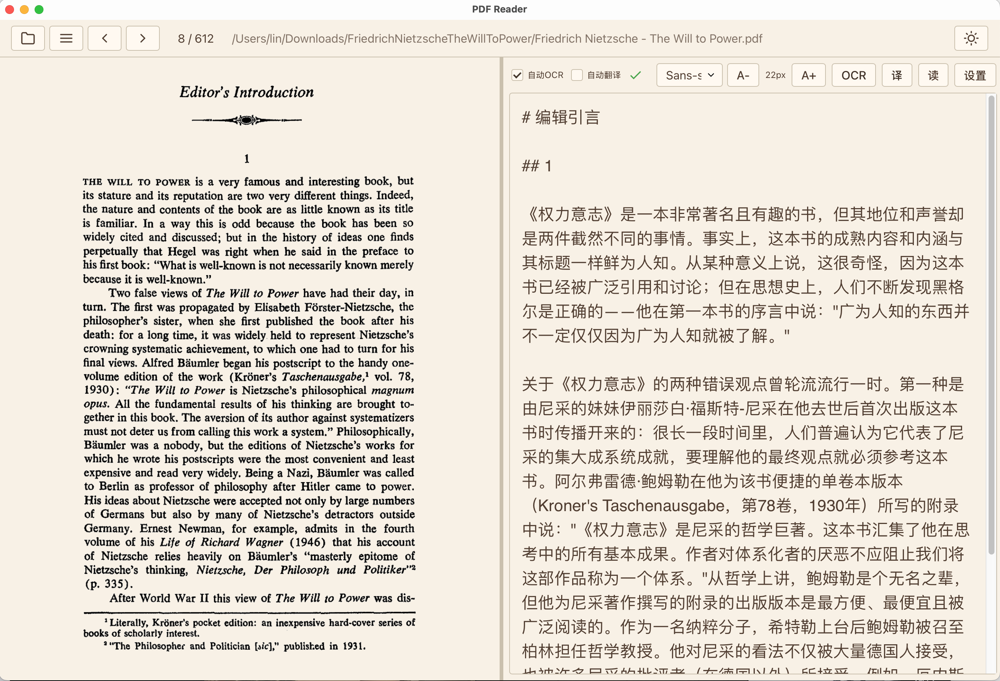
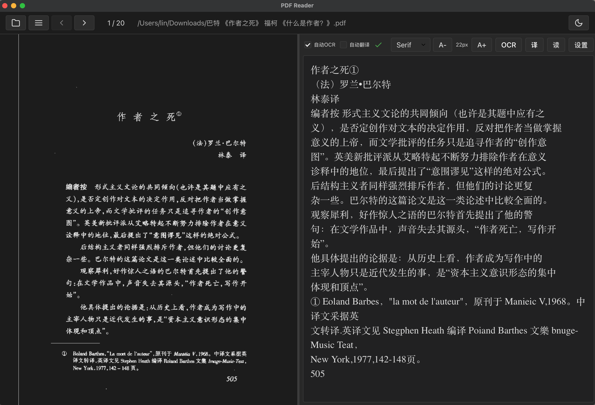

# 一个用 Tauri 开发的扫描版 PDF 阅读器

一个基于 Tauri、React 与 TypeScript 的跨平台桌面 PDF 阅读器样例项目，支持 PDF 渲染、文本提取、OCR、翻译、文字转语音（TTS）、大纲面板与色彩调整等功能，尤其适合阅读扫描版PDF。有些低清晰度的PDF阅读时比较辣眼睛、有些外文的PDF需要先OCR转换成文字再丢进翻译，这个项目就是为了满足这些需求而开发的。





## 主要特性

- PDF 渲染
- 文本提取与本地 OCR（支持Windows、macOS系统的OCR接口）
- 文字转语音（TTS）
- 文档目录大纲
- 色彩调整（原始白色、褐色护眼、暗色，使用 WebGL 加速实现）
- 与OpenAI Compatible LLM交互的翻译功能

## 技术栈

- 前端：React、TypeScript、Vite
- 后端：Tauri（Rust）
- PDF 渲染：pdfjs-dist

## 快速开始

### 环境依赖

- Node.js（建议 v18+）
- pnpm（推荐）
- Rust 工具链（通过 `rustup` 安装）
- macOS：若使用原生 Swift OCR，请安装 Xcode 与命令行工具

### 安装依赖

```bash
npm install
```

### 开发运行

```bash
npx tauri dev
```

### 构建与打包

- 打包桌面应用：

```bash
npx tauri build
```

## 项目结构（概要）

- `src/` — 前端源码（React + TypeScript）
- `src-tauri/` — Tauri 原生模块与系统API交互实现（OCR、TTS 等）
- `public/` — 静态资源
- `vite.config.ts`、`package.json` — 构建与脚本配置
